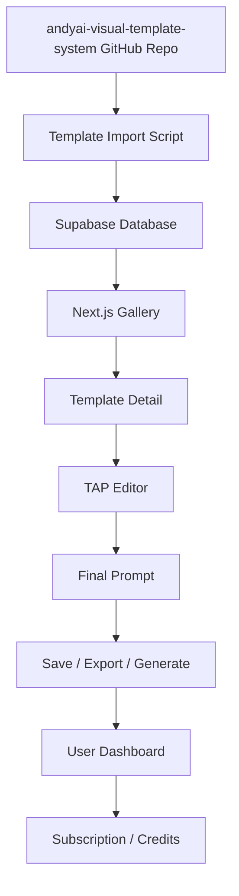

# SaaS Architecture — AndyAI Visual Studio v0.1

## High-level Architecture



## System Components

### 1. Template Source
Canonical templates live in `andyai-visual-template-system`.

### 2. Template Import Layer
Imports Markdown templates into Supabase fields.

### 3. Supabase Data Layer
Stores templates, categories, style families, user saves, prompt runs, and plans.

### 4. Next.js App
Public landing, gallery, template pages, TAP editor, dashboard.

### 5. Prompt Builder
Converts editable user input into final template prompt.

### 6. Monetization Layer
Stripe later: subscriptions, credits, teams, agency plan.

## Initial Pages

```text
/
/gallery
/templates/[slug]
/tap/[templateId]
/pricing
/dashboard
```
