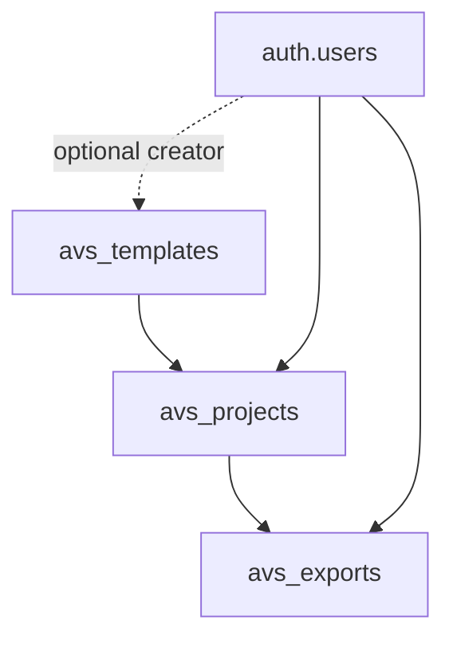

# 🧩 Data Model Map — v0.4.0

---

# 1. Template

A reusable visual production pattern.

Examples:

- Academic Sci-Fi System Map
- SaaS Product Flow Board
- Evidence Card Showroom

---

# 2. Project

A user's working copy based on a template.

It stores:

- selected template,
- user prompt,
- generated prompt,
- settings,
- status.

---

# 3. Export

A generated or saved output from a project.

Possible export types:

- prompt,
- markdown,
- html,
- svg,
- json,
- image prompt.

---

# 4. Design Principle

Template is reusable.  
Project is personal.  
Export is evidence/output.
